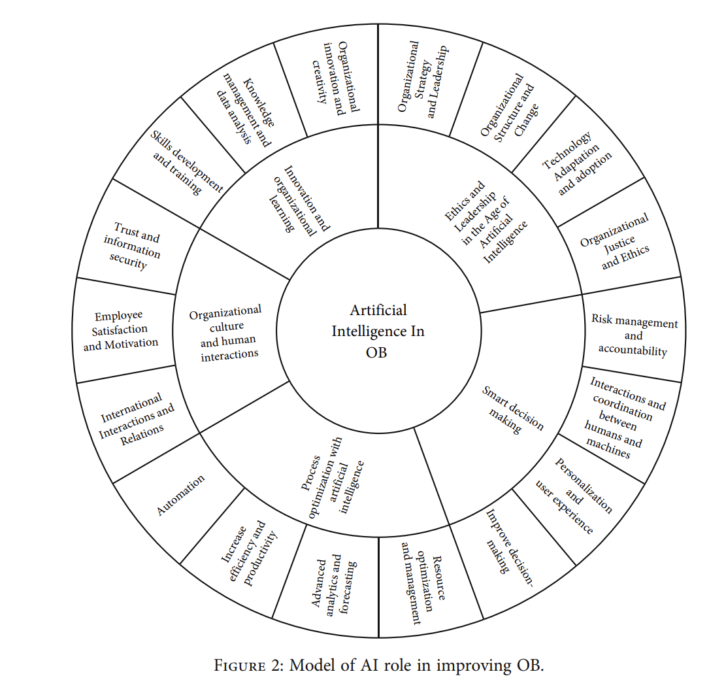

# Literature Review

## Definition of AI
The Organization for Economic Co-operation and Development (OECD) defines Artificial Intelligence (AI) as "_[...]a machine-based system that, for explicit or implicit objectives, infers, from
the input it receives, how to generate outputs such as predictions, content, recommendations, or decisions that can influence physical or virtual environments. Different AI systems vary in their levels of autonomy and adaptiveness after deployment._" ([OECD, 2024](https://www.oecd.org/content/dam/oecd/en/publications/reports/2024/03/explanatory-memorandum-on-the-updated-oecd-definition-of-an-ai-system_3c815e51/623da898-en.pdf)). It is an umbrella for a broad range of technologies, such as Large-Language Models (LLM), Agentic AI, Generative AI, robotics, computer vision and potentially General AI (AGI). In academic literature,  [Russell & Norving (2021)](https://www.pearson.com/en-us/subject-catalog/p/artificial-intelligence-a-modern-approach/P200000003500/9780137505135) define AI as "_the study of [intelligent] agents that receive precepts from the environment and take action. Each such agent is implemented by a function that maps percepts to actions, and we cover different ways to represent these functions, such as production systems, reactive agents, logical planners, neural networks, and decision-theoretic systems_". A technology common in most forms of artificial intelligence is Machine Learning (ML) where algorithms are improved through experience with a class of tasks based on performance measures [Lütge, Wagner & Welsh, (2020)](https://link.springer.com/book/10.1007/978-3-030-51110-4). 

A simpler definition is provided by [Boden (2016)](https://global.oup.com/academic/product/ai-9780198777984?cc=nl&lang=en&), who sees AI as "_computers that do the sorts of things that minds can do_". This definition sidesteps the technological characteristics of AI and puts to the fore the novel potential of AI; to augment, support or replace human thinking and creativity. While earlier technological revolutions allowed the delegation of human physical action to machines, this is arguably the first time human thinking and creativity can be delegated to an extent ([Hilbert, 2020](https://doi.org/10.31887/DCNS.2020.22.2/mhilbert); [Jackson et al, 2025](https://doi.org/10.1145/3708523); [Bijker, 2017](https://doi.org/10.17351/ests2017.170); [Tegegn, 2024](https://doi.org/10.1080/23311886.2024.2356916)).

A risk of purely technological definitions of AI is that they frame AI as a tool to improve productivity or efficiency. But technology always embodies forms of power and authority ([Winner, 1985](https://doi.org/10.4324/9781315259697-21)), shapes how we see and understand the world ([Heidegger, 1954](https://en.wikipedia.org/wiki/The_Question_Concerning_Technology)), impose behaviors on humans  ([Latour, 1992](https://www.semanticscholar.org/paper/10-%27%27Where-Are-the-Missing-Masses-The-Sociology-of-Latour/e2d2136193422030899a6d417fbbd9a20c117ae2)), and can perpetuate or strengthen biases present in training data ([Nissenbaum & Friedman, 1996](https://doi.org/10.1145/230538.230561); [Barocas & Selbst, 2016](https://dx.doi.org/10.2139/ssrn.2477899); [Noble, 2018](https://doi.org/10.2307/j.ctt1pwt9w5)). 

Thus, the rapid advancements in AI technology in recent years asks of organizations and society at large to consider how to best leverage the productivity potential of this technology while also recognizing the ethical, societal, economic and axiological questions that come with it.

## AI and productivity
AI promises to improve productivity and efficiency of individual employees as well as organizational activities more broadly. This is partially reflected in empirical studies to date, with some caveats. [Gusti et al (2024)](http://dx.doi.org/10.21511/ppm.22(3).2024.14) apply a resource-based view (RBV) to AI and frame it as a technology that can provide a competitive advantage provided it is properly supported by change leadership. Indeed, their survey study among 359 employees in the banking industry in Indonesia found a positive effect of AI use by employees on their productivity and employee engagement, although this effect was not moderated by change leadership. A study by [Necula, Fotache & Rieder (2024)](https://doi.org/10.3390/electronics13183758) also found a positive effect of AI usage on firm-level productivity across different sectors, but moderated by the level of integration of AI tools into work activities. This study also revealed an age effect, with younger employees experiencing higher productivity gains through AI. Importantly, the authors emphasize the need for ethical frameworks to help organizations integrate AI ethically and maximize its benefits. Similarly, [Czarnitzki, Fernández & Rammer, (2023)](https://doi.org/10.1016/j.jebo.2023.05.008) also found a positive effect of AI usage on productivity at the firm-level, even when controlling for sectoral AI adoption level, past innovation experience and internal resistance against innovation. 

A theoretical explanation for these findings is that AI improves decision-making and the efficiency of operational tasks ([Agrawal, Gans & Goldfarb, 2019](https://doi.org/10.1257/jep.33.2.31)). 

## AI and organizational behavior
Organizational behavior (OB) is the scientific study of how individuals, groups, and structures affect and are affected by behavior within organizations, applied toward improving organizational effectiveness ([Moorhead & Griffin, 1995](https://archive.org/details/organizationalbe5edmoor_t7o7); [Wagner & Hollenbeck, 2010](https://www.routledge.com/Organizational-Behavior-Securing-Competitive-Advantage/WagnerIII-Hollenbeck/p/book/9780367444167); [Robbins, 2004](https://archive.org/details/organizationalbe0000robb_i2c8)). It typically concerns the study of phenomena such as motivation, engagement, stress, group dynamics, structure and culture. Several empirical studies have investigated how AI relates to such phenomena. [Tortorella et al (2025)](https://doi.org/10.1080/00207543.2024.2368698) performed a multiple case study to investigate how the utilization of AI influences employee engagement (physical, emotional and cognitive) and consecutively psychological conditions (safety, meaningfulness, availability) in two manufactering companies that had been using AI for several years. They found that AI utilization in such contexts contributed to physical, cognitive and emotional engagement, thus contributing to positive psychological conditions. However, they note that a negative effect is expected when the retraining required does not match an employee's sense of self-efficacy (capability gap) or when the productivity gains from AI result in a reduction of jobs (downsizing). Another perspective on employee engagement is provided by [Braganza et al (2021)](https://doi.org/10.1016/j.jbusres.2020.08.018), who investigated AI adoption through the lense of the psychological contract between employers and employees. Based on a survey of 232 employees from a broad range of organizations, they found that employee engagement diminishes substantially when the psychological contrast between employers and employees is marked by low trust. In addition to the transactional and relational contracts currently practiced, the authors predict that AI adoption may lead to a third alienational contract. In this contract, work is performed ad-hoc and technologically oriented and informed by algorithms.

Several reviews have attempted to integrate findings to date. [Bankins et al (2023)](https://doi.org/10.1002/job.2735) identify five broad themes for AI in the workplace; human-AI collaboration, perceptions of algorithmic and human capabilities, worker attitudes towards AI, AI as a control mechanism and labor market implications. Their review also highlights that while studies show increased productivity and job satisfaction on the individual level, this depends on a good technology-task fit, trust in the algorithm, transparancy of the decision-making process and sufficient expertise. Without such preconditions, AI can cause mental overload, distraction and aversion. At the firm-level, the presence of a supportive and innovative culture reduces fear of AI, whereas hierarchical and bureaucratic cultures can result in "algorithmic cages" ([Meijer, Lorenz & Wessels, 2021](https://doi.org/10.1111/puar.13391)) that impede employee autonomy. [Bankins et al (2023)](https://doi.org/10.1002/job.2735) provides two recurring themes. First, AI should not be pursued as a means to an end, but always in consideration of how it fits the job and supports employees. Second, if AI are effectively black boxes for employees, they will increase aversion and resistance. A review by [Ateeq et al (2025)](https://doi.org/10.63332/joph.v5i4.1221) notes that AI improves performance through automation and instant feedback. Organizations can also use AI to increase worker flexibility, connectivity and collaboration. But the authors warn that this comes with many ethical and psychological queries related to trust, monitoring, transparency and fairness. Within the context of building construction, [Zhang et al. (2024)](https://doi.org/10.3390/buildings14010259) conclude that while AI provides various business intelligence strategies to improve project performance and organizational justice, issues related to fairness, risk of unemployment, bias and data privacy of AI can also undermine it.

## AI and HRM
TBD

## AI and software engineering
TBD

## AI and society
Many of the aforementioned studies highlight the tension between the technological capabilities of AI and ethical concerns. Sociologists warn that "_The potential of AI to drive progress [...] is undeniable. However, its deployment must be approached ethically and responsibly. Concerns about bias, privacy, job displacement and the digital divide must be addressed to ensure that AI benefits everyone._" [Serpa et al, 2025](https://doi.org/10.36941/ajis-2025-0003). On a societal level, it increass inequality between households that can use AI and those who can not or do not know how ([Cornelli, Frost & Mishra, 2023](https://www.bis.org/publications/working-paper-1135-artificial-intelligence-services-globalisation-and-income-inequality)). 

New technologies always confront societies with ethical challenges that must be resolved. Labor unions formed during the Industrial Revolution to balance power distribution between those working with machines and those who owned them (SOURCE). [ MORE EXAMPLES]. But every technological revolution seems to proceed faster than the one before due to globalization, economies of scale and ease of access (SOURCE). 

## Human-centered AI
One perspective on human-centered AI originates from research on robotics and human-computer interaction ([Sheridan & Verplank, 1978](https://ntrs.nasa.gov/citations/19790007441), [Sheridan, 2000](https://doi.org/10.1006/ijhc.1999.0285), [Shneiderman, 2020](https://doi.org/10.1080/10447318.2020.1741118)), which aims to aid system designers in determining the level of automation suitable for a given task. Initially, this began with a one-dimensional ten-level model by ([Sheridan & Verplank, 1978](https://ntrs.nasa.gov/citations/19790007441), [Parasuraman, Sheridan & Wickens, 2000](https://doi.org/10.1109/3468.844354)) that ranged from 'The computer offers no assistance; the human must take all decisions and actions' to 'The computer decides and acts autonomously, ignoring the human'. A similar approach is used in the five levels of autonomy for self-driving cars ([Society of Automotive Engineers, 2014](https://www.sae.org/standards/content/j3016_201401/)), from 'No automation' to 'Full autonomy'. A challenge with such one-dimensional model is that they suggest designers to choose between one or the other. Moreover, excessive human control or excessive automation may both increase risks for certain tasks. Shneiderman ([2000](https://doi.org/10.1080/10447318.2020.1741118)) recently proposed a two-dimensional model (HCAI) with the level of "human control" and "computer automation" as seperate dimensions, resulting in four quadrants. Some life-critical systems, like self-driving cars and pacemakers, require high human-control and high-automation to create what Shneiderman calls Reliable, Safe & Trustworthy (RST) systems. What these models share is that they sensitize designers to consider what level of automation is best suitable to reduce risks, and that neither full human-control or full computer-control are always desirable.

The Copenhagen Manifesto for human-centered AI in software engineering (SE) provides another perspective ([Russo et al, 2024](https://doi.org/10.1016/j.jss.2024.112115)). Created by a group of 35 prominent scholars in this field following a symposium in Copenhagen, the manifesto recognizes that "_SE practitioners and researchers have a moral duty to help the world navigate this enduring landscape of new AI technologies ethically and sustainably, and foster values such as fairness, transparency, societal wellbeing, and environmental resilience. This transformative era challenges us to extend our focus beyond technical expertise, integrating human values and ethical considerations into the fabric of our technological advancements_". It outlines five core values that reaffirm human dignity, autonomy and collective wellbeing and formulated twelve principles to act as guidelines, including responsible management, human sovereignty and the enhancement of wellbeing and creativity of software engineers that use it. Importantly, this manifesto reflects a growing concern among SE practicioners and researchers that AI may end up harming society, employees, businesses and the planet if such developments are not informed moral and ethical concerns. 

## Governance of AI
TBD

Potential "framework" examples:

[Rostamzadeh, 2025](https://doi.org/10.1155/hbe2/8094428)

## Conclusion
TBD
